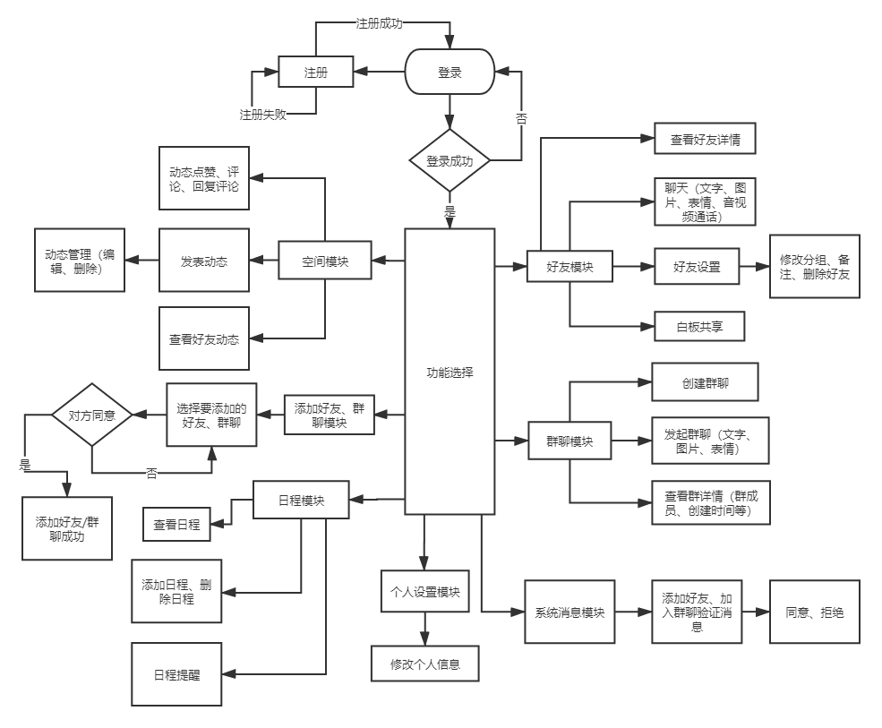

# 响应式编程

## Java 响应式 API
### Flow
### Publisher
### Subscriber
### Subscription

## WebFlux API

## Reactor

## RxJava

## IM 项目
### 创新之处
1. 多种登录模式：账号/密码登录，第三方登录(QQ, 微信, 支付宝，钉钉，飞书，邮箱，Github),密钥登录模式，人脸登录
2. 
