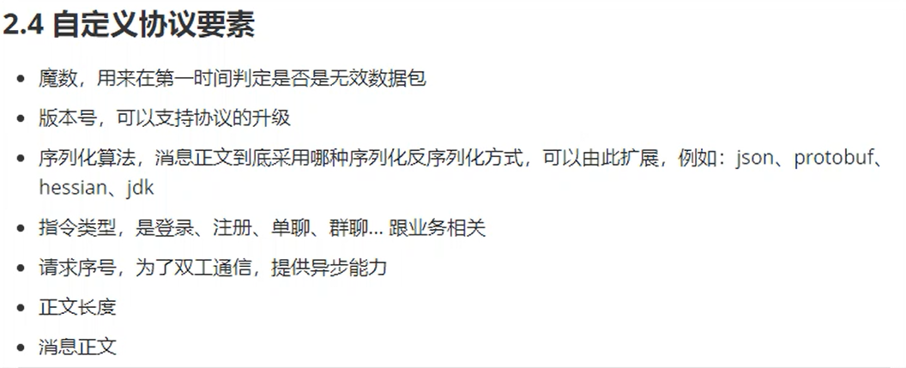

# 响应式编程

## Java 响应式 API
### Flow
### Publisher
### Subscriber
### Subscription

## WebFlux API

## Reactor

## RxJava

## IM 项目
### 自定义协议

| 魔数  | 版本号 | 序列化算法 | 指令类型 | 请求序号 | 正文长度 | 消息正文 |
|:---:|:---:|:-----:|:----:|------|------|------|
| 单元格 | 单元格 |       |      |      |      |      |
### 创新之处
1. 多种登录模式：账号/密码登录，第三方登录(QQ, 微信, 支付宝，钉钉，飞书，邮箱，Github),密钥登录模式，人脸登录
2. 
